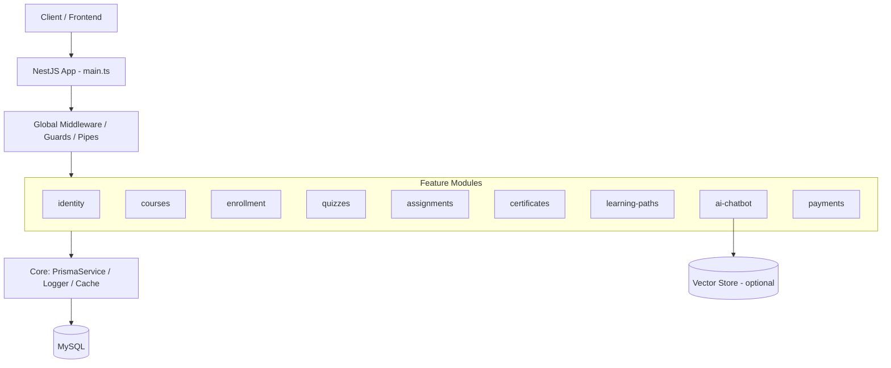
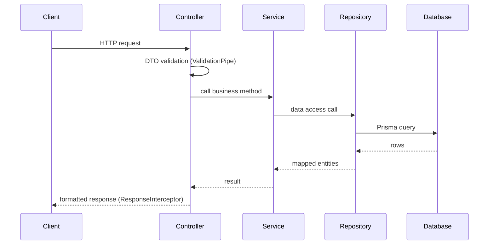

# ARCHITECTURE.md — Backend (Feature-based)

Stack: **TypeScript + NestJS + Prisma (MySQL)**. Builds on `DATABASE.md` (schema) and `PROJECT-RULES.md` (coding/isolation rules).

## 1. System Overview



**Feature-based rationale**: each business capability (courses, quizzes, chatbot, ...) maps 1:1 to a NestJS module, matching the entity groups defined in `DATABASE.md`. This keeps ownership boundaries clear as the LMS grows (new features = new folder, not new cross-cutting changes), and lets teams work on separate features without merge conflicts inside shared files.

## 2. Folder Structure

```
src/
├── config/                  # env schema, config factory (@nestjs/config)
│   └── configuration.ts
├── shared/                  # reusable, framework-agnostic building blocks
│   ├── middlewares/
│   ├── guards/
│   ├── filters/             # HttpExceptionFilter, etc.
│   ├── interceptors/        # ResponseInterceptor
│   ├── decorators/
│   ├── utils/
│   └── types/
├── core/                    # infrastructure singletons, imported once
│   ├── database/
│   │   └── prisma.service.ts
│   ├── logger/
│   └── cache/
├── features/
│   ├── identity/
│   ├── courses/
│   ├── enrollment/
│   ├── quizzes/
│   ├── assignments/
│   ├── certificates/
│   ├── learning-paths/
│   ├── reviews/
│   ├── notifications/
│   ├── ai-chatbot/
│   └── payments/
├── app.module.ts
└── main.ts
```

## 3. Feature Anatomy

```
features/quizzes/
├── quiz.controller.ts       # routing, DTO validation, response mapping
├── quiz.service.ts          # business logic (scoring, pass/fail rules)
├── quiz.repository.ts       # Prisma calls only
├── dto/
│   ├── create-quiz.dto.ts
│   └── submit-attempt.dto.ts
├── entities/
│   └── quiz.entity.ts
├── types/
│   └── quiz.types.ts
├── utils/
│   └── scoring.util.ts
├── tests/
│   ├── quiz.service.spec.ts
│   └── quiz.controller.spec.ts
├── quiz.module.ts           # imports / providers / exports
└── context.md               # purpose, owned entities, public API
```

## 4. Request Flow



- **Controller**: routing, request validation, calls one service method, formats response — no business logic.
- **Service**: business rules (e.g., quiz scoring, enrollment eligibility), orchestrates one or more repositories, may call other features' **exported services**.
- **Repository**: Prisma queries only — no business logic, no validation.

## 5. Cross-feature Communication

| Allowed | Forbidden |
|---|---|
| Inject another feature's exported service (e.g., `EnrollmentService` injects `CourseService` from `CourseModule.exports`) | `import { CourseRepository } from '../courses/course.repository'` from another feature |
| Emit/listen domain events (`@nestjs/event-emitter`) — e.g., `enrollment.completed` → `certificates` listens and issues certificate | Reaching into another feature's `dto/`, `entities/`, or `repository` files directly |
| Queue-based async jobs (e.g., BullMQ) for heavy work: AI quiz generation, embedding indexing | Circular module imports (`quizzes` ↔ `assignments`) |

Example event flow:


## 6. Shared vs Core

| Shared (`src/shared/`) | Core (`src/core/`) |
|---|---|
| Reusable utilities (date formatting, pagination helpers) | Infrastructure setup, instantiated once |
| Common types/interfaces (`PaginatedResult<T>`) | `PrismaService` — single DB connection |
| Guards (`JwtAuthGuard`, `RolesGuard`) | `LoggerService` configuration |
| Decorators (`@CurrentUser()`) | Cache client (Redis) setup |
| Global filters/interceptors | Health-check providers |

Rule of thumb: **Shared** = stateless helpers any feature can import freely. **Core** = stateful/infrastructure singletons injected via DI, never re-instantiated per feature.

## 7. Configuration Management

- **Environment variables**: `.env` per environment (`.env.development`, `.env.production`), loaded via `@nestjs/config` with a validated schema (`Joi` or `zod`) in `config/configuration.ts`. App fails fast on startup if required vars are missing.
- **Config files structure**: `config/configuration.ts` exports typed sections (`database`, `jwt`, `ai`, `storage`) consumed via `ConfigService.get('database.url')` — no `process.env` access outside `config/`.
- **Secrets handling**: secrets (`DATABASE_URL`, `JWT_SECRET`, AI provider keys) never committed; injected via deployment platform's secret manager; `.env*` files gitignored except `.env.example`.

## [NestJS-Specific Additions]

- **DI setup**: every feature module declares `providers` (service, repository) and `exports` (service only) — repository is never exported, enforcing the layering rule from `PROJECT-RULES.md`.
- **Middleware chain** (registered once in `main.ts`): `helmet()` → `CorsMiddleware` → global `ValidationPipe` → global `HttpExceptionFilter` → global `ResponseInterceptor`.
- **PrismaService** lives in `core/database`, injected into each feature's repository via constructor DI — never instantiated with `new PrismaClient()` inside a feature.
- **AppModule** imports `ConfigModule.forRoot()` and `CoreModule` globally, then all `features/*` modules explicitly — no auto-discovery, to keep the dependency graph explicit and reviewable in PRs.