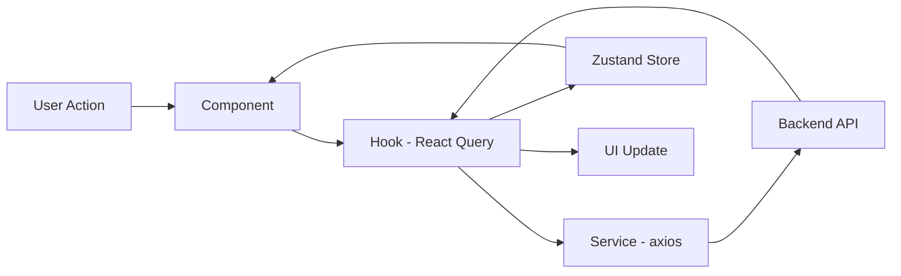

# ARCHITECTURE.md — Frontend (Feature-based)

Stack: **React 18 + TypeScript (Vite), React Router, Zustand + React Query, TailwindCSS, Axios**. Consumes the backend defined in `API_SPEC.md`; coding rules in `PROJECT-RULES.md` (FE).

## 1. Overview

Feature-based architecture: each business capability (courses, quizzes, chatbot, ...) is a self-contained folder owning its UI, hooks, services, and state — mirroring the backend's `features/*` modules and `API_SPEC.md` endpoint groups, so a backend feature change has one obvious frontend folder to update.

**Tech stack justification**:
- **React + Vite**: fast dev/build, large ecosystem, matches TypeScript end-to-end with the NestJS backend (shared DTO/type conventions).
- **React Query**: purpose-built for server-state caching/invalidation — avoids hand-rolled loading/error/cache logic for the many list/detail endpoints in `API_SPEC.md`.
- **Zustand**: minimal boilerplate for the few genuinely global states (auth, UI theme) without Redux's ceremony.
- **TailwindCSS**: utility-first, no per-component CSS files to maintain, consistent design tokens across features.

## 2. Folder Structure

```
src/
├── app/
│   ├── main.tsx              # entry point
│   ├── App.tsx                # root component, layout shell
│   ├── routes/
│   │   ├── router.tsx         # route config, lazy imports
│   │   └── ProtectedRoute.tsx
│   └── providers/
│       ├── QueryProvider.tsx  # React Query client
│       └── AuthProvider.tsx
├── shared/
│   ├── components/            # Button, Modal, Skeleton, ...
│   ├── hooks/                 # useDebounce, useMediaQuery
│   ├── services/
│   │   └── api.ts             # axios instance, interceptors
│   ├── stores/
│   │   ├── auth.store.ts
│   │   └── ui.store.ts
│   ├── types/
│   └── utils/
├── features/
│   ├── courses/
│   ├── enrollment/
│   ├── quizzes/
│   ├── assignments/
│   ├── certificates/
│   ├── learning-paths/
│   ├── reviews/
│   ├── notifications/
│   ├── ai-chatbot/
│   └── payments/
├── assets/                    # images, icons, fonts
└── styles/
    └── globals.css            # Tailwind base + custom tokens
```

## 3. Feature Anatomy

```
features/quizzes/
├── components/
│   ├── QuizCard.tsx
│   └── QuizAttemptForm.tsx
├── hooks/
│   ├── useQuiz.ts             # React Query wrapper
│   └── useQuizAttempt.ts
├── services/
│   └── quiz.service.ts        # axios calls to /quizzes/*
├── stores/
│   └── quiz.store.ts          # local attempt state (if needed)
├── types/
│   └── quiz.types.ts
├── utils/
│   └── scoring.util.ts
├── pages/
│   └── QuizAttemptPage.tsx    # routed page composing the above
├── index.ts                   # public barrel
└── context.md
```

## 4. Data Flow



Components never call `services/` directly — always through a feature `hook`, which owns caching (React Query) and, if needed, writes derived UI state into the feature's Zustand slice.

## 5. Cross-feature Communication

| Method | Use case |
|---|---|
| Global store (`shared/stores`) | Auth/current user, app-wide UI (theme, sidebar) |
| URL / Router | Navigating between features with params, e.g. `courses/:id → quizzes/:quizId` |
| Event emitter (`mitt`, rare) | Decoupled side effects, e.g. `quiz:completed` triggers `learning-path` progress refetch without a direct import |

Feature components/hooks are exposed cross-feature only via each feature's `index.ts` barrel (per `PROJECT-RULES.md`).

## 6. Routing Structure

```mermaid
flowchart TB
  Router --> Public[Public routes]
  Router --> Protected[Protected routes - ProtectedRoute]
  Public --> Login[/login/]
  Public --> CourseCatalog[/courses/]
  Protected --> Dashboard[/dashboard/]
  Protected --> QuizAttempt[/quizzes/:id/attempt]
  Protected --> Instructor[/instructor/* - role: INSTRUCTOR]
```

- **Public routes**: landing, course catalog/detail, login, register, certificate verification.
- **Protected routes**: wrapped in `<ProtectedRoute>` (checks `auth.store`), redirects to `/login` if unauthenticated; role-gated sub-trees (e.g. `/instructor/*`) check `user.role`.
- **Route config per feature**: each feature exports its route definitions from `pages/`, aggregated in `app/routes/router.tsx` — no feature registers routes on its own.
- **Lazy loading**: every feature page is `React.lazy()` + `Suspense` with a route-level skeleton fallback, so unused features (e.g. `payments`) aren't in the initial bundle.

## 7. State Management Strategy

| State Type | Location | Example |
|---|---|---|
| Server state | React Query | Course list, quiz detail, chat messages (cached, revalidated) |
| Global UI | `shared/stores/ui.store.ts` (Zustand) | Theme, sidebar collapsed |
| Auth | `shared/stores/auth.store.ts` (Zustand) | Current user, access token |
| Feature state | `features/[x]/stores` (Zustand) | In-progress quiz attempt, form draft |
| Local UI | Component `useState` | Modal open, input focus |

## 8. API Layer

```
shared/services/api.ts        (axios instance: base URL, auth interceptor, error normalization)
        ↓
features/quizzes/services/quiz.service.ts   (typed calls: getQuiz, submitAttempt)
        ↓
features/quizzes/hooks/useQuiz.ts           (useQuery/useMutation wrapper, cache keys)
        ↓
features/quizzes/components/QuizCard.tsx    (renders data, calls hook actions)
```

`shared/services/api.ts` attaches `Authorization: Bearer <token>` from `auth.store`, and on `401 AUTH_002` (per `API_SPEC.md`) triggers the refresh-token flow transparently before retrying the original request.

## 9. Shared vs Features

| Shared | Features |
|---|---|
| Generic UI components (`Button`, `Modal`, `Skeleton`) | Feature-specific components (`QuizCard`, `AssignmentSubmissionForm`) |
| Base `api` client, response/error normalization | Feature `*.service.ts` — typed endpoint calls |
| Generic hooks (`useDebounce`, `useMediaQuery`) | Feature hooks wrapping React Query for that feature's endpoints |
| Generic utils (formatters, validators) | Feature utils (e.g., quiz scoring, certificate rendering) |

## [React-Specific Additions]

- **Routing**: `react-router-dom` v6, `createBrowserRouter` with nested layouts; each feature's `pages/` exports a route object consumed by `app/routes/router.tsx`.
- **State library patterns**: Zustand stores use selector functions at call sites (`useAuthStore(s => s.user)`) to avoid unnecessary re-renders; stores kept small and feature-scoped rather than one monolithic store.
- **React Query defaults**: `staleTime: 30s` for list endpoints, `staleTime: 5min` for rarely-changing data (categories); mutations invalidate the relevant query keys on success (e.g., submitting an attempt invalidates `['quiz', id]`).
- **SSR/SSG**: not used — this is a client-rendered SPA (Vite). Revisit only if SEO on the public course catalog becomes a requirement, at which point a framework migration (e.g., Next.js) would be evaluated separately.