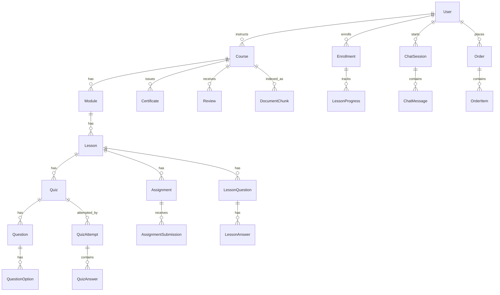

# DATABASE.md

## Core Features
- **Identity**: User, RefreshToken
- **Courses**: Category, Course, Module, Lesson, Resource
- **Enrollment**: Enrollment, LessonProgress
- **Quizzes**: Quiz, Question, QuestionOption, QuizAttempt, QuizAnswer
- **Assignments**: Assignment, AssignmentSubmission
- **Certificates**: Certificate
- **Learning Paths**: LearningPath, LearningPathItem, LearningPathEnrollment
- **Reviews**: Review
- **Notifications**: Notification
- **Lesson Q&A**: LessonQuestion, LessonAnswer
- **AI Chatbot (RAG)**: ChatSession, ChatMessage, DocumentChunk
- **Payments**: Order, OrderItem

---

## 1. Overview

- **Database**: MySQL 8+
- **ORM**: Prisma
- **Naming**: tables `snake_case` plural (`users`, `quiz_attempts`); columns `snake_case` in DB, `camelCase` in Prisma via `@map`; indexes `idx_<table>_<column>`; FKs `<table>_<ref_table>_fkey` (Prisma default).

## 2. Entities by Feature

### Feature: Identity

| Table | Fields | Indexes |
|---|---|---|
| `users` | id (PK, cuid), email (unique), password, full_name, avatar_url?, bio? (text), role (enum), status (enum), created_at, updated_at, deleted_at? | unique(email) |
| `refresh_tokens` | id (PK), user_id (FK→users), token_hash, expires_at, revoked_at?, created_at | idx(user_id) |

### Feature: Courses

| Table | Fields | Indexes |
|---|---|---|
| `categories` | id (PK), name, slug (unique), parent_id? (FK→categories) | unique(slug) |
| `courses` | id (PK), title, slug (unique), description (text), thumbnail_url?, price (decimal), level (enum), status (enum), instructor_id (FK→users), category_id? (FK→categories), created_at, updated_at, deleted_at? | idx(instructor_id), idx(category_id) |
| `modules` | id (PK), course_id (FK→courses), title, order (int) | idx(course_id) |
| `lessons` | id (PK), module_id (FK→modules), title, type (enum), video_url?, content? (text), duration_sec?, order (int) | idx(module_id) |
| `resources` | id (PK), lesson_id (FK→lessons), file_url, file_name, file_type | idx(lesson_id) |

### Feature: Enrollment

| Table | Fields | Indexes |
|---|---|---|
| `enrollments` | id (PK), student_id (FK→users), course_id (FK→courses), status (enum), enrolled_at, completed_at? | unique(student_id, course_id), idx(course_id) |
| `lesson_progress` | id (PK), enrollment_id (FK→enrollments), lesson_id (FK→lessons), status (enum), watched_seconds, completed_at? | unique(enrollment_id, lesson_id) |

### Feature: Quizzes

| Table | Fields | Indexes |
|---|---|---|
| `quizzes` | id (PK), lesson_id? (FK→lessons), title, is_ai_generated (bool), pass_score, time_limit_sec? | idx(lesson_id) |
| `questions` | id (PK), quiz_id (FK→quizzes), type (enum), content (text), points, order | idx(quiz_id) |
| `question_options` | id (PK), question_id (FK→questions), content, is_correct (bool) | idx(question_id) |
| `quiz_attempts` | id (PK), quiz_id (FK→quizzes), student_id (FK→users), score?, started_at, submitted_at? | idx(quiz_id), idx(student_id) |
| `quiz_answers` | id (PK), attempt_id (FK→quiz_attempts), question_id (FK→questions), selected_option_id? (FK), answer_text?, is_correct (bool) | idx(attempt_id), idx(question_id) |

### Feature: Assignments

| Table | Fields | Indexes |
|---|---|---|
| `assignments` | id (PK), lesson_id (FK→lessons), title, description (text), due_date?, max_score | idx(lesson_id) |
| `assignment_submissions` | id (PK), assignment_id (FK), student_id (FK→users), file_url?, content? (text), submitted_at, score?, feedback? (text), graded_by_id? (FK→users), graded_at? | unique(assignment_id, student_id), idx(student_id) |

### Feature: Certificates

| Table | Fields | Indexes |
|---|---|---|
| `certificates` | id (PK), student_id (FK→users), course_id (FK→courses), certificate_code (unique), certificate_url, issued_at | unique(student_id, course_id) |

### Feature: Learning Paths

| Table | Fields | Indexes |
|---|---|---|
| `learning_paths` | id (PK), title, description? (text), created_by_id? (FK→users), is_ai_generated (bool) | — |
| `learning_path_items` | id (PK), learning_path_id (FK), course_id (FK→courses), order | unique(learning_path_id, course_id) |
| `learning_path_enrollments` | id (PK), student_id (FK→users), learning_path_id (FK), progress_percent, started_at, completed_at? | unique(student_id, learning_path_id) |

### Feature: Reviews

| Table | Fields | Indexes |
|---|---|---|
| `reviews` | id (PK), course_id (FK→courses), student_id (FK→users), rating (1-5), comment? (text), created_at | unique(student_id, course_id), idx(course_id) |

### Feature: Notifications

| Table | Fields | Indexes |
|---|---|---|
| `notifications` | id (PK), user_id (FK→users), type, title, content (text), is_read (bool), created_at | idx(user_id) |

### Feature: Lesson Q&A

| Table | Fields | Indexes |
|---|---|---|
| `lesson_questions` | id (PK), lesson_id (FK→lessons), student_id (FK→users), content (text), created_at | idx(lesson_id) |
| `lesson_answers` | id (PK), question_id (FK→lesson_questions), author_id (FK→users), content (text), created_at | idx(question_id) |

> **Note**: an answer's "is this from the instructor?" badge is derived at read time from `author.role`, not stored — no `is_instructor_answer` column.

### Feature: AI Chatbot (RAG)

| Table | Fields | Indexes |
|---|---|---|
| `chat_sessions` | id (PK), student_id (FK→users), course_id? (FK→courses), title?, created_at | idx(student_id) |
| `chat_messages` | id (PK), session_id (FK→chat_sessions), role (enum), content (text), tokens_used?, created_at | idx(session_id) |
| `document_chunks` | id (PK), course_id (FK→courses), lesson_id? (FK→lessons), content (text), embedding? (json — see note), metadata? (json), chunk_index | idx(course_id) |

> **Note**: `embedding` (JSON) is an MVP fallback. Production should store vectors in a dedicated vector store (pgvector/Qdrant/Pinecone), joined by `document_chunks.id`.

### Feature: Payments

| Table | Fields | Indexes |
|---|---|---|
| `orders` | id (PK), student_id (FK→users), total_amount (decimal), status (enum), paid_at?, created_at | idx(student_id) |
| `order_items` | id (PK), order_id (FK→orders), course_id (FK→courses), price (decimal) | idx(order_id) |

### Shared Entities
`users` and `courses` are referenced across nearly every feature (enrollment, quizzes, reviews, certificates, chat, payments) — treated as **shared core entities**, owned by `identity` and `courses` modules respectively.

## 3. Relationships

- **Convention**: FK column named `<singular_entity>_id`; every FK is indexed.
- **Cross-feature relationships** (e.g., `Enrollment.course_id → Course`) are allowed at the DB level; the ownership rule applies to service/code layers, not foreign keys — a feature's service must not import another feature's service directly.

## 4. Conventions

- **Primary key**: `cuid()` string IDs (collision-safe, sortable, API-safe — avoids sequential ID enumeration).
- **Soft delete**: `deleted_at` nullable timestamp on `users`, `courses` only; hard delete elsewhere.
- **Timestamps**: `created_at` (default now) and `updated_at` (`@updatedAt`) on all mutable entities.
- **Enums**: defined explicitly in Prisma (e.g., `UserRole`, `CourseStatus`, `LessonType`) — no free-text status columns.

## 5. Migration Rules

- **Naming**: `YYYYMMDDHHMMSS_<verb>_<description>` (Prisma default via `prisma migrate dev --name`), e.g. `20260720_add_learning_paths`.
- **Versioning**: one migration per PR/feature; never edit an applied migration — create a new corrective one.
- **Rollback**: no automatic down-migrations (Prisma limitation) — maintain a manual rollback script per migration for production incidents; test on staging before applying to prod.

## [Prisma-Specific Additions]
- Enable `previewFeatures = ["prismaSchemaFolder"]` to physically split schema files per feature (`prisma/schema/<feature>.prisma`).
- Use `@map`/`@@map` on every model/field to keep `snake_case` in MySQL while using `camelCase` in application code.
- Run `prisma format` + `prisma validate` in CI before merging schema changes.